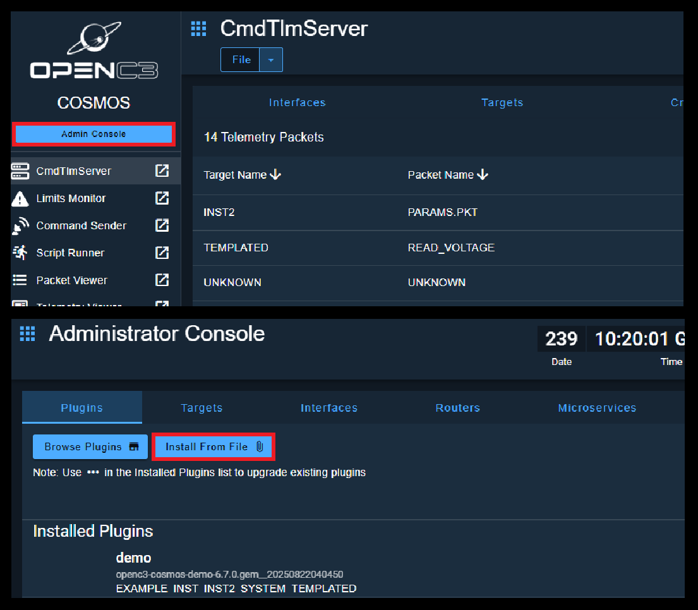

# Zendir OpenC3 Plugin

This plugin enables communication from the Zendir products into OpenC3 via standard [CCSDS](https://ccsds.org/) protocols, including the space packets and standard message structures, formatted in XML. Data can be streamed from the Zendir environment, including Zendir Studio, Space Range and the Zendir API. For more information, visit the [Zendir Documentation](https://docs.zendir.io).

For more information on [OpenC3](https://openc3.com), see the public documentation. Zendir is not responsible for OpenC3 development, nor is Zendir affiliated or responsible for OpenC3 or its products. This plugin is simply an integration into their COSMOS tool.

---

## Installation

Install the base OpenC3 COSMOS project from the OpenC3 GitHub page. This can be done via:

```sh
git clone https://github.com/OpenC3/cosmos-project.git
```

This includes the relevant source files for running the project. For Windows or Mac users, make sure to have **Docker Desktop** installed and started, as it will require a Linux container to run correctly.

For more information on installing OpenC3 COSMOS, please refer to the OpenC3 installation guide that can be found [here](https://docs.openc3.com/docs/getting-started/installation).

Once the repository is installed, clone this repository into the root of the `cosmos-project` directory, aptly named `openc3-cosmos-zendir`.

---

## Getting Started

To start the OpenC3 COSMOS application, run the `openc3.sh` file, or the `openc3.bat` file for Windows users, in the root directory. Make sure to include the keyword argument `run` to start the container.

##### Linux / Mac users:
```sh
.\openc3.sh run
```

##### Windows users:
```sh
.\openc3.bat run
```

> For Windows or Mac users, make sure that Docker engine has started. Once started, running the COSMOS container for the first time make take some time to install the required dependencies.

Next, the `.gem` file must be installed correctly. This will contain the binaries associated with the Plugin that COSMOS is able to import. Navigate to the `openc3-cosmos-zendir` folder and run the following command:

##### Linux / Mac:
```sh
..\openc3.sh cli rake build VERSION=1.0.0 
```

##### Windows:
```sh
..\openc3.bat cli rake build VERSION=1.0.0 
```

This step is only required whenever changes have been made to the Zendir plugin. If no changes are made, the Ruby files are not required to be recreated.

---

## Adding the Plugin

Once the container is running, navigate to the container webpage (likely http://localhost:2900 unless configured differently) and follow the steps below.

1. Go to the OpenC3 COSMOS **Admin Console** and find the **Plugins** Tab
2. Click the 'Install from File' button and choose the `openc3-cosmos-zendri-[VERSION].gem` file
3. Fill out plugin parameters for the associated server information
4. Click **Install**



If any changes are made to the plugin source code, simply **upgrade** the plugin, which will overwrite any details the plugin has.

> To change the details for the server information for streaming the data, simply click the three dots and press 'Edit Details'.

---

## Building tool / widget plugins using Docker and the openc3-node container

If you don’t have a local node environment, you can use the OpenC3 `openc3-node` container to build custom tools and custom widgets.

##### Linux / Mac:

```sh
docker run -it -v `pwd`:/openc3/local:z -w /openc3/local docker.io/openc3inc/openc3-node sh
```

##### Windows:

```sh
docker run -it -v %cd%:/openc3/local -w /openc3/local docker.io/openc3inc/openc3-node sh
```

1. ``yarn``
2. ``rake build VERSION=1.0.0``

---

## License

This OpenC3 plugin is released under the MIT License. See [LICENSE.txt](LICENSE.txt).
